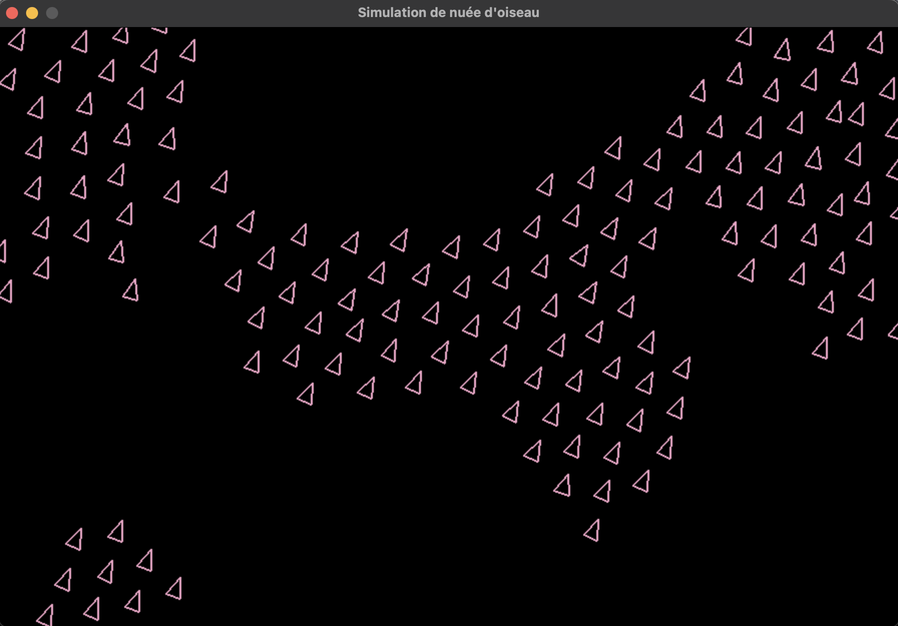

# Simulation de Nuée d'Oiseaux (Boids)

Simulation de comportement émergent d'une nuée d'oiseaux utilisant l'algorithme des Boids, développée avec Pygame.

## Description

Les Boids (contraction de "bird-oid objects") sont un modèle de vie artificielle créé par Craig Reynolds en 1986. Chaque oiseau suit trois règles simples qui créent un comportement de groupe complexe et réaliste.

## Les Trois Règles

### 1. **Séparation** 
Éviter les collisions avec les voisins proches.

Chaque oiseau détecte ses voisins dans un rayon de séparation. Plus un voisin est proche, plus la force de répulsion est forte. Cela empêche les oiseaux de se superposer.

### 2. **Alignement**
Se diriger dans la même direction que ses voisins.

Chaque oiseau calcule la direction moyenne de ses voisins dans un rayon d'alignement et ajuste progressivement sa propre direction pour correspondre au groupe.

### 3. **Cohésion**
Rester proche du centre du groupe.

Chaque oiseau calcule la position moyenne de ses voisins dans un rayon de cohésion et applique une force pour se rapprocher de ce point central.
